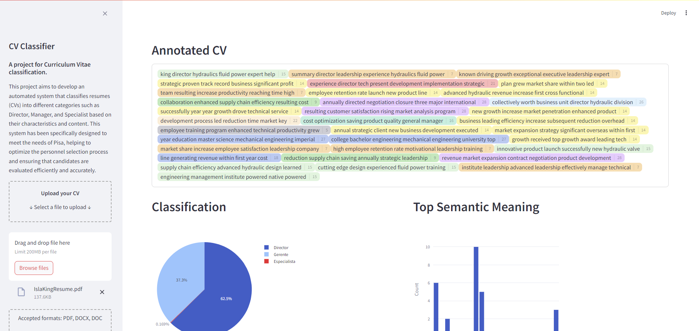

# Grupo PiSA - CV Classifier

This project aims to develop an automated system that classifies resumes (CVs) into different categories such as Director, Manager, and Specialist based on their characteristics and content. This system has been specifically designed to meet the needs of Pisa, helping to optimize the personnel selection process and ensuring that candidates are evaluated efficiently and accurately. 

## Main features

* **Embedding Calculation:** Computes embeddings of a fixed number of tokens from the CVs. These embeddings represent important information for us as abstract concepts that are related to the CVs, aiding in more nuanced classification.

* **NLP Feature Extraction:** Extracts additional NLP features such as TF-IDF (Term Frequency-Inverse Document Frequency) to capture the significance of words in the CVs relative to the overall dataset.

* **OCR Integration:** Uses Optical Character Recognition (OCR) to convert resumes in PDF format to text, enabling analysis of documents that are not in plain text format.

* **Document Translation:** Translates all documents to a common language, which in this case is English, ensuring uniformity in the analysis process.

## Main technologies used

* **Python:** The main programming language used for the project. We used Python 3.12.2 for this project.
* **NLTK:** NLP libraries for text extraction and analysis.
* **SentenceTransformer:**  Python framework for state-of-the-art sentence, text and image embeddings
* **Pandas:** Data manipulation and analysis library for Python
* **PyTesseract:** Open-source Python wrapper for Google's Tesseract-OCR Engine. It enables Python developers to extract text from images using the Tesseract OCR engine
* **PDF2Image:** Python library that converts PDF files into image files, such as JPEG or PNG. It leverages the `poppler `library to facilitate this conversion.
* **Spire:** It is a python library used for PDF processing.

## Setup and Installation

1. Clone the repository

To use this project, the first thing you need to do is to clone this repository

```
git clone https://github.com/Mau124/CV-Classifier.git
```

2. Set up your working folders

You need to create an input folder with Director, Gerente and Especialista folders inside it; An output folder and a txt_data folder with Director, Gerente and Especialista folders inside it. At the end the project structure should look like this:

```
| [root]
|--data
    |--input
       |--Director
       |--Especialista
       |--Gerente
    |--output
|--txt_data
    |--Director
    |--Especialista
    |--Gerente
|--config.yml
|--main.py
|--requirements.txt
```

Then, you can add the CVs to be processed in the input folder in their respective category. In addittion, you could also modify the config.yml file to add the path to the CVs to be processed, but take into account that the path needs to have three folders inside, one for Director, other one for Especialista and one for Gerente. Finally if you are going to modify the config.yml file, try to modify just the input path and not the output or the txt_data paths. 

3. Environment Setup

You can create a conda environment or a python environment using the requirements file.

```
# Using pip and venv
cd CVClassifier
python -m venv <name>
source env/bin/activate
pip install -r requirements.txt

# Using Conda
cd CVClassifier
conda create --name <env_name> --file requirements.txt
```

4. You need to install Poppler and Tesseract to do the conversion from CVs to txt

### Poppler

pdf2image is a python library used to convert pdf files to images. This library requires different requisites depending on the OS you're using. If you're using Windows or Mac OS, you need to download Poppler. If you're using Windows, you can download Poppler from its [Github](https://github.com/oschwartz10612/poppler-windows/releases/) repo. If you're using Mac OS, you can follow the steps to download poppler from [here](https://poppler.freedesktop.org/).
If you are using Linux, most distros ship with pdftoppm and pdftocairo. If they are not installed, refer to your package manager to install poppler-utils. You can check where it is poppler installed by running: `dpkg -L poppler-utils`. 

After installing Poppler, unzip the folder and change the `poppler_path` variable in `main.py` to search for your poppler folder. Example = `poppler_path = 'D:/users/poppler-24.02.0/Library/bin'`. If you are using Linux, then you can check the poppler path by using `dpkg -L poppler-utils`. Usually it is in `/usr/bin`. You can double check this for your system.

### Tesseract

Tesseract is the OCR software used in this project. To install Tesseract, follow these [steps](https://tesseract-ocr.github.io/tessdoc/Installation.html). You can install tesseract in Linux by just running: 

```
sudo apt install tesseract-ocr
sudo apt install libtesseract-dev
```

After installing Tesseract, change the `pytesseract.pytesseract.tesseract_cmd` variable in `main.py` to search for your tesseract folder. Example = `pytesseract.pytesseract.tesseract_cmd = '/usr/local/opt/tesseract/bin/tesseract'`.In Linux, tesseract is usually found in this path `/usr/bin/tesseract`, but double check for your system.

## Usage

One of the objectives of this project is to be easy to use. Because of it, you only need to add the CVs for _director_, _gerente_ and _especialista_ into their respective folders in the input folder. 

After that, you just have to run main.py file. You can do it by using the IDE and python environment you prefer or by using the command line:

```
cd CVClassifier
conda activate pisa
python main.py
```

## Demo

For the demo, we developed a web page using Streamlit to provide better insights into why our model classifies certain responses the way it does. In this demo, you can upload a resume and see each sentence highlighted in a different color. Each color represents a different cluster, allowing us to observe that resumes for managerial positions contain many clusters related to management and leadership. For more details on how this demo and the entire model function, please refer to the "Analysis" folder for the pipeline and the "demo_website" folder for the website.



## Authors of the project

This project was made by: [ernestogm812](https://github.com/ernestogm812), [A-Hermosillo](https://github.com/A-Hermosillo), [arctom](https://github.com/arctom) and [Mau124](https://github.com/Mau124)

#### Disclaimer

This project was developed as a one time project and completed within a set timeframe. It is no longer maintained by the authors, and some sections of the code lack thorough documentation due to tight deadlines. There is significant potential for improvements and refactoring in both the Analysis and demo codebases.